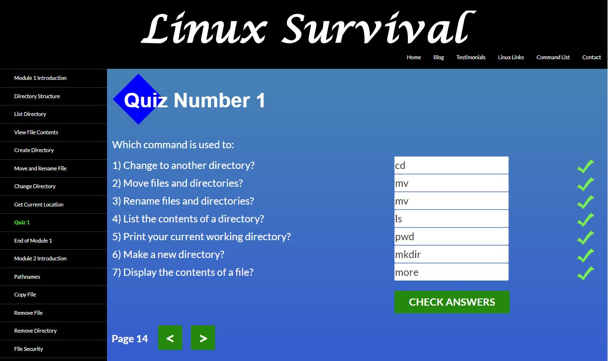
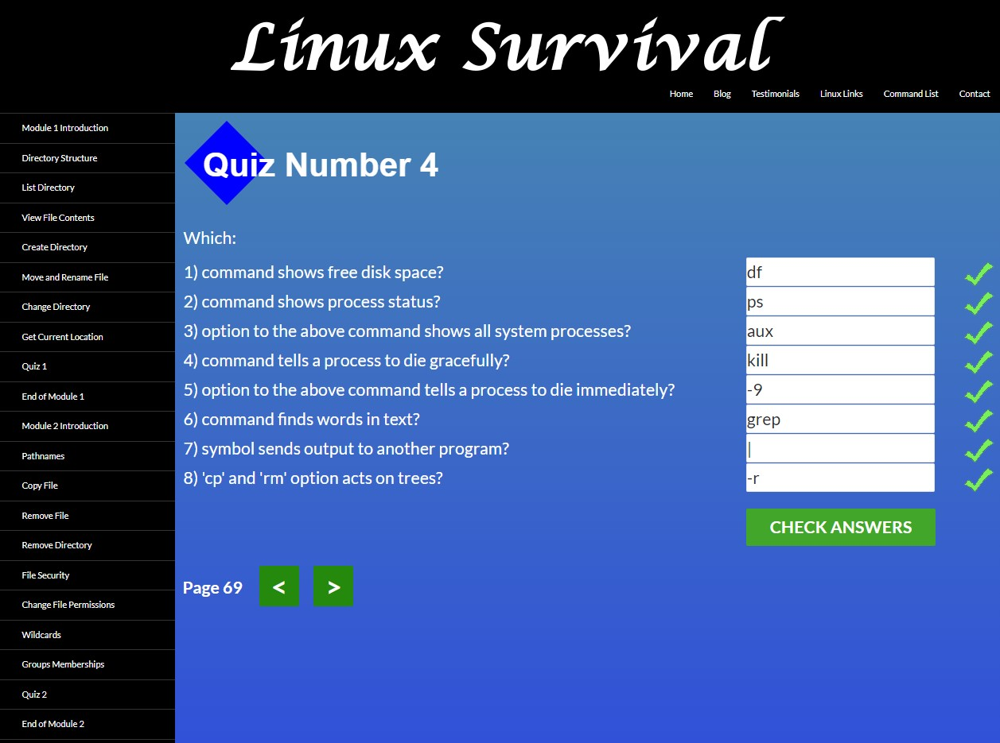

# kottans-frontend

# GIT
Practice https://learngitbranching.js.org/?locale=uk
Learning https://www.coursera.org/learn/introduction-git-github/lecture/21kjM/rollbacks 
Check out the following links for more information:

https://git-scm.com/doc
https://www.mercurial-scm.org/
https://subversion.apache.org/

https://en.wikipedia.org/wiki/Version_control

Git resources available online:
Pro Git: This book (available online and in print) covers all the fundamentals of how Git works and how to use it. Refer to it if you want to learn more about the subjects that we cover throughout the course.

Git tutorial: This tutorial includes a very brief reference of all Git commands available. You can use it to quickly review the commands that you need to use.
diff(1) — Linux manual page 
https://man7.org/linux/man-pages/man1/diff.1.html 

https://docs.gitlab.com/runner/install/windows.html

Coursera:
The diff tool shows all the differences between any type of file. By highlighting what’s changed, it helps us understand the changes and see how the files have been modified.

While diff is the command that generates the difference between two files, patch is the command that applies those differences to the original file.
To automatically apply changes to a file, we need to run the patch command on the file that we want to modify with the diff file as input.

The git directory acts as a database for all the changes tracked in Git and the working tree acts as a sandbox where we can edit the current versions of the files.

## Linux CLI, and HTTP

Linux CLI tasks were not so hard as I expected. Git pull request was much harder)
I finished tasks without issues. Got to know a lot of commands. I think in studying Linux CLI should be first and then GIT.

HTTP articles was not for beginners. Need to learn more about HTTP.

## Git Collaboration

Links to screenshots of completed studies:

On Coursera: [Managing Collaboration](GIT_Collaboration/Week4_Managing_Collaboration.jpg), [Pull request](GIT_Collaboration/Week4_Pull_request.png)

On learngitbranching.js.org: [Main](GIT_Collaboration/Learninggitbranching_1_main.png), [Remote](GIT_Collaboration/Learninggitbranching_2_remote.png)

I'm very glad of completion courses about GIT. Now I know how to work with it.

Especially I liked this command: "git pull origin Branchname~1:Branchname".
 Means I pull commits except the last one and I specified source Branch and destination Branch to pull.
 